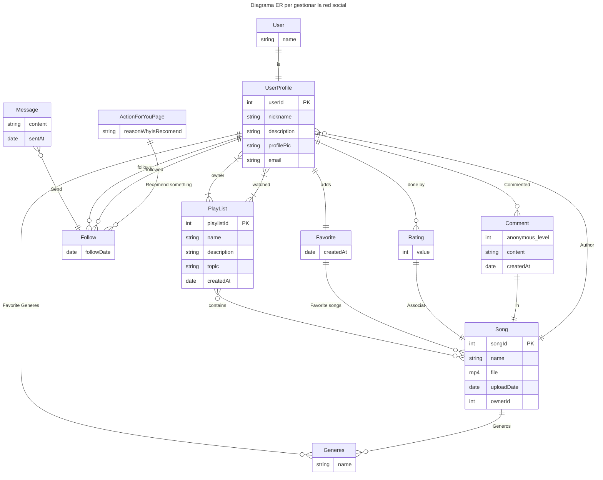

    classDef weakEntity fill:#f9f,stroke-dasharray: 5 5
    class ActionForYouPage weakEntity

| Mètode | URL                                                 | Descripció                   |
| ------ | --------------------------------------------------- | ---------------------------- |
| GET    | `/api/v1/userprofile/`                                    |           |
| POST   | `/api/v1/userprofile/`                                    |             |
| GET    | `/api/v1/userprofile/{id}/`                               |         |
| PUT    | `/api/v1/userprofile/{id}/`                               | Modificar la informació d'un Usuari    |
| PATCH  | `/api/v1/userprofile/{id}/`                               | Modificar la informació d'un Usuari   |
| DELETE | `/api/v1/userprofile/{id}/`                               | Eliminar un Usuari         |
| GET    | `/api/v1/playlist/`                                    | Llistat de cançons          |
| POST   | `/api/v1/playlist/`                                    | Crear una llista de cançons (playlist)            |
| GET    | `/api/v1/playlist/{id}/`                               | Veure la informació d'una playlist        |
| PUT    | `/api/v1/playlist/{id}/`                               | Modificar la informació playlist    |
| PATCH  | `/api/v1/playlist/{id}/`                               | Modificar la informació playlist    |
| DELETE | `/api/v1/playlist/{id}/`                               | Eliminar una partida         |
| GET    | `/api/v1/playlist/{id}/songs/`                       | Llistat de jugadors en una partida    |
| POST   | `/api/v1/playlist/{id}/songs/`                       | Afegeix una canço a la playlist (codi: #{"song_id":1})      |
| GET    | `/api/v1/playlist/{gid}/songs/{pid}/`                | Veure les dades d'un jugador de la partida     |
| DELETE | `/api/v1/playlist/{gid}/songs/{pid}/`                | Eliminar un jugador de la partida   |

